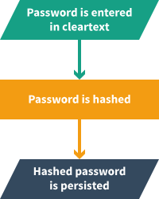
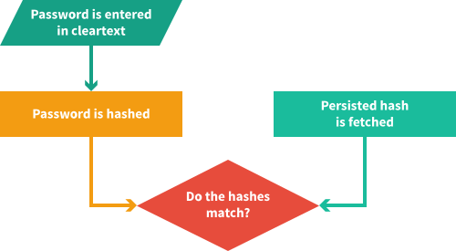
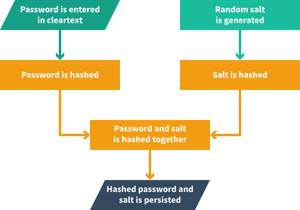
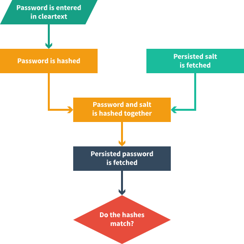

It goes without saying that passwords should be handled with a certain type of carefulness. Storing passwords in cleartext is a practice of the past. In fact, using passwords at all, as means of authentication, seems to be slowly going away in favour of [Passwordless Authentication](https://auth0.com/blog/how-passwordless-authentication-works/).

However, there is still a need for passwords, and a need for us to know, how to use them to authenticate users in a secure way. This is a lightweight introduction to the theory of hashing and salting passwords.

## Have yourself a hash function

**Hashing** refers to the operation of applying a [hash function](https://en.wikipedia.org/wiki/Hash_function) with a key, e.g. a password. The return value of the hash function is an obfuscated version of the key, commonly referred to as the **hash**.

```js
hashFunction(key)
// => hash
```

A hash function takes an input of arbitrary length and returns an output of fixed length. To obfuscate the input it uses a hash algorithm.

Here is an example of a theoretical hash function that uses the [SHA256](https://en.wikipedia.org/wiki/SHA-2) algorithm to obfuscate its input:

```js
sha256HashFunction('short string')
// => 9b5fface991e9154008ca1f446c6ce661197c96ba72329ea98261f8b508b7087

sha256HashFunction('short string')
// => 9b5fface991e9154008ca1f446c6ce661197c96ba72329ea98261f8b508b7087

sha256HashFunction('short string2')
// => 553f885a886981d23aba4f354c6076639f8fc2ff0e9dfe4881a4c2bb35c0bedc

sha256HashFunction('slightly longer string')
// => 6de683fb40f37c042cbad165f799228f02bc0eff7eee56a2c9cb30a503cc5e99
```

The same input always yields the same output, two very similar inputs yield a very different output, and in theory, **no two different inputs should yield the same output**.

The last bit is very important (hence the bolded text). It's what makes it possible to use hash values to do the **integrity checking**.

## Using hashes to check integrity

It is a common approach to use hashes for file verification. When downloading a file, e.g. a piece of software from a website, the website can provide what is commonly referred to as a **checksum**. A checksum is merely the digital fingerprint of the file. Locally, a new checksum can be calculated for the downloaded file and compared to the checksum provided on the website. If the two checksums match, the file has - probably not - been corrupted:

```js
checksumFromWebsite == hashFunction(file)
```

The "probably not" goes hand in hand with the "in theory" of the prior section. One of the desired properties of a hash function is that it should be **collision resistant**. However, most hash functions don't stand the test of time and are eventually proven not to be.

The same principle applies when a system checks the authenticity of a user. When the user first registers themselves in a system, they enter their desired password in cleartext. The password is then hashed and persisted in a database:



To re-enter the system, the user again enters their password in cleartext. Again, the password is hashed, and to check the user's integrity, the hashed password is compared to the persisted one from the database:



## Is it offensive to add salt?

The approach described above is better than storing passwords in cleartext, but in the real world it's not sufficient. The reason is mainly something called [rainbow tables](http://kestas.kuliukas.com/RainbowTables/). A rainbow table is basically a precomputed list of cleartext keys and their respective hashes. Using a rainbow table it is thus possible to derive a password from it's hash. To guard against this, it is common practice to add **salt**.

A salt is a random piece of data used to obfuscate the password even further. The reason rainbow tables work is because a hash function always yields the same output for the same input. Adding some salt to the mix makes the use of these tables impractical because a hash value no longer can be matched to the original input:

```js
hashFunction(hashFunction('pass123') + hashFunction(randomSalt))
// => hash

hashFunction(hashFunction('pass123') + hashFunction(randomSalt))
// => different hash
```

Nothing has changed about how a user registers themselves in a system or how they re-enter it. But the process of checking their integrity is slightly changed. Upon registration, they still enter their desired password in cleartext which is then hashed. In addition a random salt is generated, hashed and persisted. The salt is then hashed together with the hashed password to create what can be considered a unique hash for this input at this point:



When re-entering the system, the user's supplied password is hashed, the related salt is fetched and the two are hashed together. The final hash is then compared to the hash persisted in the database:



## Conclusion

In this post we have merely dipped our toes into the ocean of cryptography in order to get a better understanding of password management. Even though many of the concepts introduced are far more complex than presented here, it should have been a lightweight introduction to password integrity checking.
